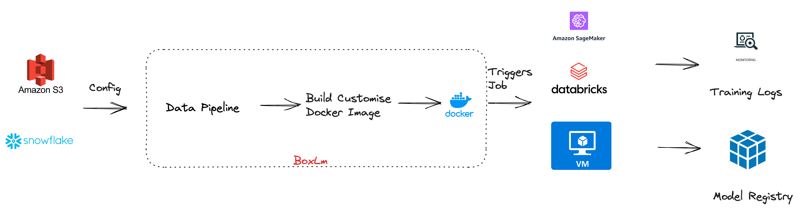

# BoxLM 

<b>Note: WIP </b>

#### BoxLM (Box the Large models), is a platform agnostic tool that allows users to deploy and finetune large models with ease.

## Features 

- FineTune and deploy any model with single click. 
- Keep your sensitive data within your environment, eliminating concerns about data privacy and security. 

### Installation 

1. From PyPI 
                
                pip install boxlm

2. From Git Repository 

                python setup.py install 

### Finetune or transfer learning 

With BoxLM, Single click fine-tuning experience 

1. Sample Command 
   
                boxlm fine-tune -m <model_id> -p <platform> -c <config_file>

### Deploying trained model 

Single click Deployment experience

                boxlm deploy -m <model_id> -i <image_path> -p <platform> -c <config_file> 