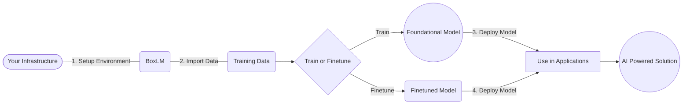

## BoxLM 

Note: WIP 

BoxLM is a powerful toolkit that enables users to deploy and train/finetune foundational models with ease, directly on their own infrastructure. With BoxLM, you can leverage state-of-the-art language models without worrying about your data moving out of your environment.

## Features 

- FineTune and deploy any model with single click. 
- Keep your sensitive data within your environment, eliminating concerns about data privacy and security. 

